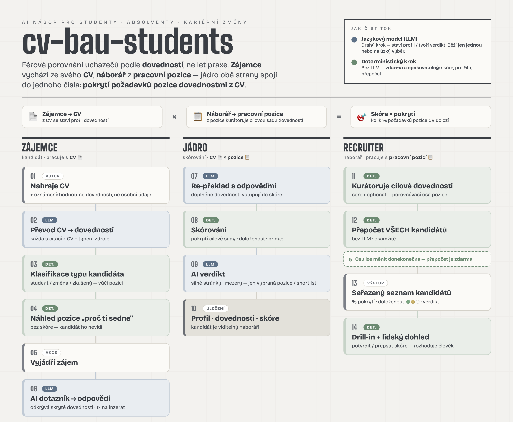
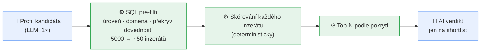

# cv-bau-students

> Anglická referenční verze: [`docs/README.en.md`](docs/README.en.md) ·
> technický hloubkový popis (diagramy, scoring, file\:line): [`docs/ARCHITECTURE.md`](docs/ARCHITECTURE.md)

> **Hlavní myšlenka v jedné větě.**
> Přelož CV bez praxe na dovednosti → změř, jaké **% náborářem vybrané cílové
> sady dovedností** kandidát pokrývá → ukaž to transparentně.
>
> Skóre je **deterministické** — do samotného výpočtu žádný LLM nevstupuje; LLM
> jen **extrahuje, překládá a vysvětluje**. Z toho plyne všechno ostatní: místo
> „let praxe" měříme **„% pokrytí dovedností"**, takže **student i senior stojí
> na stejné ose**.

## Co to je

AI platforma, která **férově porovná studenty, absolventy a kariérní změny
s pracovními inzeráty** — na základě **dovedností, ne let praxe**. CV bez
„odpracovaných let" převede na dovednosti a ukáže náboráři, do jaké míry kandidát
pokrývá to, co pozice opravdu vyžaduje. Drahý jazykový model přitom CV jen
**přečte a přeloží na dovednosti**; **porovnání i skóre jsou deterministické** —
levné, okamžité a reprodukovatelné.

## Jaký problém řeší

Student nebo absolvent nemá „5 let praxe" — ale **má dovednosti**: ze školních
projektů, diplomky, brigád, kurzů, předchozího oboru. Klasický nábor ho odmítne
hned na prahu („nesplňuje roky praxe"), i když umí přesně to, co je potřeba.

Tahle platforma jeho zkušenost **přeloží na dovednosti srovnatelné s praxí**
a porovná ji se zadáním zaměstnavatele na **jedné, společné, férové ose**:
*kolik procent požadovaných dovedností kandidát doloží* — místo *kolik má let*.
Student a zkušený uchazeč tak stojí na stejné stupnici.

## Přednosti projektu

- **Férová osa.** Skóre = **% pokrytí požadovaných dovedností**, ne roky praxe.
  Junior i senior se měří stejně.
- **Doloženost.** U každé dovednosti je vidět, **čím je podložená** — praxí,
  projektem, nebo jen uvedená v CV. Odolné vůči nafukování životopisů.
- **Transparentnost a soulad.** Skóre je **podpora rozhodnutí, ne automatické
  odmítnutí**; hodnotí se **dovednosti, ne osobní údaje**; je tu auditní stopa
  a rámec EU AI Act / GDPR (viz [`docs/MODEL_CARD.md`](docs/MODEL_CARD.md)).
- **Levné a škálovatelné hledání.** Drahý jazykový model (LLM) převede CV na
  profil **jen jednou**; samotné hledání nejlepší pozice je **deterministické,
  bez LLM** — proto je levné i pro tisíce inzerátů.

## Dvě role v aplikaci

Aplikace má dvě záložky — dva pohledy na tentýž proces:

| Role | Co dělá | Co vidí |
|---|---|---|
| **Zájemce** (kandidát) | nahraje CV, prohlédne si pozici, vyjádří zájem, odpoví na pár otázek | **skóre NEvidí** — vidí jen dopředu hledící doporučení „co doložit, aby seděl líp" |
| **Recruiter** | kurátoruje cílové dovednosti pozice, prochází kandidáty | seřazený seznam s **% pokrytí + doložeností + AI verdiktem** a možností rozhodnutí přepsat |

## Jak to funguje (přehled)

Celý proces na jednom obrázku. 🧠 = krok s jazykovým modelem (drahý, běží **jednou**),
⚙️ = deterministický krok (bez LLM, **zdarma a opakovatelný**).

```mermaid
flowchart LR
    U([CV]) --> P["🧠 CV → dovednosti"] --> C["⚙️ klasifikace typu"] --> Q["🧠 AI dotazník"] --> S["⚙️ skórování<br/>pokrytí·doloženost·bridge"] --> RE["🧠 verdikt"] --> DB[("uložení")]
    DB --> K["⚙️ náborář:<br/>cílové dovednosti"] -->|"↻ zdarma"| RS["⚙️ přepočet všech"] --> L(["seznam · drill-in · dohled"])
    classDef llm fill:#e8f0fe,stroke:#1b4f9c,color:#14181f;
    classDef det fill:#e7f3ea,stroke:#2f7d4f,color:#14181f;
    class P,Q,RE llm;
    class C,S,RS det;
```

📄 Verze pro slidy / tisk: [PDF](docs/process-poster.pdf) · [PNG](docs/process-poster.png).

Textová (GitHub-native) verze diagramu

**Klíč k levné škále:** drahý 🧠 LLM staví profil a verdikt jen na úzký výběr;
osa skóre je ⚙️ deterministická → náborář ji mění donekonečna a vše se přepočítá
zdarma. *(Plný vizuál: [poster](docs/process-poster.png).)*

---

## Proces ZÁJEMCE (podle DEMO)

| # | Co kandidát dělá / vidí | Na pozadí | DEMO → nasazení |
|---|---|---|---|
| 1 | Nahraje CV + vidí oznámení *„hodnotíme dovednosti, ne osobní údaje"* | extrakce profilu, **slepá k pohlaví/věku/jménu** | stejné |
| 2 | Profil zpracován + štítek typu 📚/🔄/💼 | 🧠 CV → dovednosti (citace + typ zdroje); ⚙️ **klasifikace typu vůči pozici** (přebíjí odhad LLM) | DEMO: 1 inzerát · nasazení: korpus |
| 3 | Náhled pozice + „proč ti sedne" — **bez skóre** | ⚙️ porovnání dovedností, bez LLM → okamžité | stejné |
| 4 | „Mám zájem" → 2–3 cílené otázky | 🧠 dotazník **odkrývá skryté dovednosti**; 1× na inzerát, všem stejné | DEMO: prázdné · nasazení: AI-předvyplnění |
| 5 | Odpoví vlastními slovy a odešle | 🧠 odpovědi → profil → re-překlad → ⚙️ **přeskórování** | stejné |
| 6 | Potvrzení odeslání | kandidát viditelný náboráři | stejné |

*Typ kandidáta určí deterministický klasifikátor vůči pozici:
< 2 roky reálné praxe / jen brigády / studuje → **student**; ≥ 2 roky v jiném oboru
→ **kariérní změna**; ≥ 2 roky v souladu → **zkušený**.
→ [`detector/classify.py`](src/cv_bau_students/detector/classify.py)*

> **DEMO specifika:** seed obsahuje **6 syntetických CV** (3 studenti + 3 zkušení,
> všechny smyšlené) a **jeden inzerát** „Datový analytik / Datová analytička"
> u fiktivní firmy *ApexFinance s.r.o.*. Cílové dovednosti pozice **kurátoruje
> náborář** (viz dále).

---

## Proces RECRUITER (podle DEMO)

1. **Banner**: *skóre = podpora rozhodnutí, ne automatické odmítnutí.*
2. **Skill-picker** — náborář kurátoruje **cílovou sadu** (core / optional;
   návrh z ISCO povolání inzerátu). Uložení **přepočítá všechny kandidáty
   deterministicky**. Tahle sada je **porovnávací osa**.
3. **Sloupce** Studenti / Zkušení / Career-changers — stejná osa, oddělené zobrazení.
4. **Řádek**: jméno · % pokrytí · doloženost → rozklik = **drill-in**.

### Drill-in — „Co která hodnota znamená"

Definice **vytažené přímo z kódu** (ne vymyšlené):

| Hodnota | Co znamená | Zdroj |
|---|---|---|
| **Skill coverage %** | *headline skóre.* Podíl kurátorované cílové sady, který kandidát doloží: `100 × \|∩\| / \|cíl\|` (bez kurátorování = must ∪ nice z inzerátu). `total = coverage`. | `_skill_fit` |
| **Bridge fit** | *potenciál (vedle headline).* Doplnitelnost mezer v měsících (0 → 100, 24 → 0); „jen praxí — bez zkratky" → strop **35**; bez rubriky → **N/A**. | `_bridge_fit` + `levels/repo.py` |
| **Doloženost 🟢🟡⚪** | čím je dovednost podložená: 🟢 praxe/stáž/cert · 🟡 projekt/studium · ⚪ jen uvedeno. Štítek **vysoká / střední / nízká**. | `evidence.py` |
| **Counterfactual** | *„Doložit X → N % → M %"* — o kolik vyskočí pokrytí po doložení dané dovednosti. Bez LLM (GDPR/CJEU protipříklad). | `counterfactual_lifts` |
| **AI zdůvodnění** | verdikt + silné stránky + mezery + otázky na pohovor; váží **doložené > uvedené**. | `reasoning.md` |
| **Confidence band** | ± pásmo z jistoty překladu (`max(5, 30 − 25·avg)`) → varování *„nízká doloženost"*, když převažuje ⚪. | `_confidence_band` |
| **Lidský dohled** | náborář **potvrdí / přepíše** skóre s poznámkou (AI Act čl. 14 / GDPR čl. 22). | override |
| **Audit napříč typy** | míra výběru + four-fifths poměr napříč typy — *transparentní metrika, ne pass/fail brána*. | `analytics/audit.py` |

Drill-in čte **shora dolů jako prezentace**: skóre → pokrytí + doloženost →
dovednosti → **AI verdikt** → odpovědi kandidáta → původní CV.

---

## DEMO vs plné nasazení

| Aspekt | DEMO teď | Plné nasazení |
|---|---|---|
| **Hledání pozice** | single-target — jeden inzerát se předá jako cílová pozice | **korpusové hledání už je v kódu**: SQL pre-filtr → skórování → top-N (viz níže) |
| **Data** | 6 syntetických CV + 1 inzerát (ApexFinance) | reálné CV + reálný korpus inzerátů |
| **AI-prefill dotazníku** | prázdné odpovědi (žádné AI-vymyšlené) | předvyplnění návrhem z CV, kandidát upraví |
| **Úložiště** | SQLite (seed se obnoví při startu) | Postgres/Neon — nahraná CV přežijí restart |
| **Cílové dovednosti** | kurátoruje náborář ručně přes skill-picker | stejně (náborář je vždy autorita osy) |

**Jak funguje korpusové hledání (už existuje, nejen plán):** drahý LLM postaví
profil **jednou**; pak deterministický pre-filtr v SQL zúží inzeráty podle úrovně,
domény a překryvu dovedností; každý zbylý inzerát se **deterministicky** oskóruje
a vrátí se top-N; **LLM verdikt** (zdůvodnění) běží **jen na užší výběr**. Tím je
hledání levné i ve velkém.

→ [`matcher/rank.py::rank_candidate`](src/cv_bau_students/matcher/rank.py) + [`jobads/repo.py::find_candidate_ads`](src/cv_bau_students/jobads/repo.py)

---

## Technický hloubkový popis

Diagramy (vrstvy, sekvence cesty kandidáta, datový model), přesná scoring
matematika a odkazy do kódu (file\:line) jsou v
**[`docs/ARCHITECTURE.cs.md`](docs/ARCHITECTURE.cs.md)** (🇬🇧
[anglicky](docs/ARCHITECTURE.md)). Compliance a limity:
**[`docs/MODEL_CARD.md`](docs/MODEL_CARD.md)**.

## Data a atribuce

Používá klasifikaci **ESCO** Evropské komise (v1.2.x,
[CC BY 4.0](https://creativecommons.org/licenses/by/4.0/),
<https://esco.ec.europa.eu>) a česká **NSP/CDK** data o kompetencích (CC0,
[data.mpsv.cz](https://data.mpsv.cz)). Přibalený `seed.sqlite.gz` je role-scoped
výřez tohoto importu. Demo CV jsou syntetická (Apache-2.0). Plné podmínky:
[NOTICES.md](NOTICES.md).

## Licence

Kód: MIT — viz [LICENSE](LICENSE). Přibalená data: dle datasetu, viz
[NOTICES.md](NOTICES.md).
