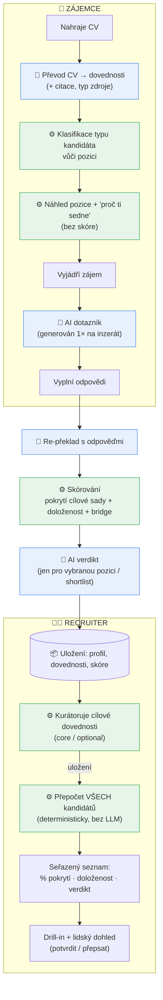
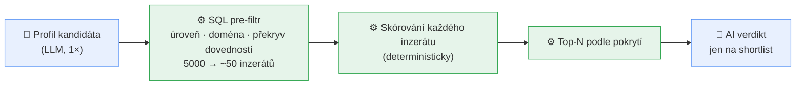

# cv-bau-students

> Anglická referenční verze: [`docs/README.en.md`](docs/README.en.md) ·
> technický hloubkový popis (diagramy, scoring, file\:line): [`docs/ARCHITECTURE.md`](docs/ARCHITECTURE.md)

## Co to je

AI platforma, která **férově porovná studenty, absolventy a kariérní změny
s pracovními inzeráty** — na základě **dovedností, ne let praxe**. CV bez
„odpracovaných let" převede na dovednosti a ukáže náboráři, do jaké míry kandidát
pokrývá to, co pozice opravdu vyžaduje.

## Jaký problém řeší

Student nebo absolvent nemá „5 let praxe" — ale **má dovednosti**: ze školních
projektů, diplomky, brigád, kurzů, předchozího oboru. Klasický nábor ho odmítne
hned na prahu („nesplňuje roky praxe"), i když umí přesně to, co je potřeba.

Tahle platforma jeho zkušenost **přeloží na dovednosti srovnatelné s praxí**
a porovná ji se zadáním zaměstnavatele na **jedné, společné, férové ose**:
*kolik procent požadovaných dovedností kandidát doloží* — místo *kolik má let*.
Student a zkušený uchazeč tak stojí na stejné stupnici.

## Přednosti projektu

- **Férová osa.** Skóre = **% pokrytí požadovaných dovedností**, ne roky praxe.
  Junior i senior se měří stejně.
- **Doloženost.** U každé dovednosti je vidět, **čím je podložená** — praxí,
  projektem, nebo jen uvedená v CV. Odolné vůči nafukování životopisů.
- **Transparentnost a soulad.** Skóre je **podpora rozhodnutí, ne automatické
  odmítnutí**; hodnotí se **dovednosti, ne osobní údaje**; je tu auditní stopa
  a rámec EU AI Act / GDPR (viz [`docs/MODEL_CARD.md`](docs/MODEL_CARD.md)).
- **Levné a škálovatelné hledání.** Drahý jazykový model (LLM) převede CV na
  profil **jen jednou**; samotné hledání nejlepší pozice je **deterministické,
  bez LLM** — proto je levné i pro tisíce inzerátů.

## Dvě role v aplikaci

Aplikace má dvě záložky — dva pohledy na tentýž proces:

| Role | Co dělá | Co vidí |
|---|---|---|
| **Zájemce** (kandidát) | nahraje CV, prohlédne si pozici, vyjádří zájem, odpoví na pár otázek | **skóre NEvidí** — vidí jen dopředu hledící doporučení „co doložit, aby seděl líp" |
| **Recruiter** | kurátoruje cílové dovednosti pozice, prochází kandidáty | seřazený seznam s **% pokrytí + doložeností + AI verdiktem** a možností rozhodnutí přepsat |

## Jak to funguje (přehled)

Celý proces na jednom obrázku. 🧠 = krok s jazykovým modelem (drahý, běží **jednou**),
⚙️ = deterministický krok (bez LLM, **zdarma a opakovatelný**).

**Klíč k levné škále:** drahý LLM staví profil a tvoří verdikt jen na úzký výběr;
osa skóre (pokrytí) je deterministická → náborář může osu měnit donekonečna
a vše se přepočítá zdarma.

---

## Proces ZÁJEMCE (krok po kroku — podle DEMO)

U každého kroku: **(a)** co kandidát vidí/dělá · **(b)** co se děje na pozadí ·
**(c)** rozdíl *DEMO* vs *plné nasazení*.

### 1. Nahrání CV
- **(a)** Kandidát nahraje CV (PDF / DOCX / TXT). Nahoře vidí **transparentní
  oznámení**: „Používáme AI k převodu CV na dovednosti; hodnotíme dovednosti, ne
  osobní údaje; skóre je podpora pro náboráře — rozhoduje člověk."
- **(b)** Z textu se vytáhne strukturovaný profil (vzdělání, projekty, brigády,
  dovednosti, jazyky). Extrakce je **slepá k pohlaví/věku/jménu** — ta do skóre
  nevstupují.
- **(c)** *DEMO i nasazení stejné.*

### 2. Zpracování profilu
- **(a)** Po pár sekundách kandidát vidí, že profil byl zpracován + štítek typu
  (📚 student / 🔄 kariérní změna / 💼 zkušený).
- **(b)** Dvě věci: **(1)** dovednosti z CV se „přeloží" na taxonomicky
  uchopitelné dovednosti (např. *„diplomka na NLP v Pythonu"* → *Python, strojové
  učení, zpracování textu*), každá s **citací z CV** a **typem zdroje** (praxe /
  projekt / brigáda…). **(2)** Deterministický klasifikátor určí **typ kandidáta
  vůči cílové pozici** (viz [`detector/classify.py`](src/cv_bau_students/detector/classify.py)):
  < 2 roky reálné praxe / jen brigády / studuje / čerstvý absolvent → *student*;
  ≥ 2 roky práce v *jiném* oboru než pozice → *kariérní změna*; ≥ 2 roky práce
  v souladu s pozicí → *zkušený*. Tento Pythonový verdikt **přebíjí** odhad LLM.
- **(c)** **DEMO:** profil se rovnou porovnává s **jedním** inzerátem (předaným
  do procesu jako cílová pozice). **Nasazení:** profil se hledá napříč **korpusem
  inzerátů** — to už je v kódu hotové (viz „DEMO vs plné nasazení" níže).

### 3. Náhled pozice + „proč ti sedne"
- **(a)** Kandidát vidí detail pozice (popis, klíčové dovednosti, jazyky) a krátké
  **deterministické** shrnutí „proč ti sedne" (které dovednosti sedí, co chybí).
  **Skóre se kandidátovi nezobrazuje.**
- **(b)** Shrnutí se skládá z výsledku porovnání dovedností — **bez LLM**, takže
  je okamžité a reprodukovatelné.
- **(c)** *DEMO i nasazení stejné* (v nasazení by zde byl výběr z více pozic).

### 4. Vyjádření zájmu → AI dotazník
- **(a)** Kandidát klikne „Mám zájem" a dostane **2–3 cílené otázky** k pozici
  (např. „popište situaci, kdy jste pomocí SQL řešil/a netriviální analytický
  problém").
- **(b)** Otázky **odkrývají skryté dovednosti**, které z CV nejsou vidět. Jsou
  **vygenerované jen jednou na inzerát** a všem kandidátům se kladou stejné
  (férovost + úspora).
- **(c)** **DEMO:** odpovědi v seedu jsou prázdné (žádné AI-vymyšlené odpovědi).
  **Nasazení:** systém umí pole **předvyplnit** návrhem vytaženým z CV, kandidát
  ho přijme nebo přepíše.

### 5. Vyplnění odpovědí → přepočet
- **(a)** Kandidát odpoví vlastními slovy a odešle.
- **(b)** Odpovědi se **promítnou do profilu**, dovednosti se znovu přeloží a
  pozice se **přeskóruje** — to, co kandidát doplnil, se může objevit jako nová
  doložená dovednost.
- **(c)** *DEMO i nasazení stejné.*

### 6. Potvrzení
- **(a)** Potvrzovací karta „přihláška odeslána". Kandidát je teď viditelný
  v náborářském pohledu.
- **(c)** *DEMO i nasazení stejné.*

> **DEMO specifika:** seed obsahuje **6 syntetických CV** (3 studenti + 3 zkušení,
> všechny smyšlené) a **jeden inzerát** „Datový analytik / Datová analytička"
> u fiktivní firmy *ApexFinance s.r.o.*. Cílové dovednosti pozice **kurátoruje
> náborář** (viz dále).

---

## Proces RECRUITER (podle DEMO)

### 1. Hlavička pozice + transparentní banner
Náborář vidí pozici a banner: *„Skóre = podpora rozhodování, ne automatické
odmítnutí — finální rozhodnutí je na tobě. Hodnotíme dovednosti, ne osobní údaje."*

### 2. Skill-picker (kurátorování cílové sady)
Náborář vybere dovednosti, které pro roli **skutečně** vyžaduje — rozdělené na
**core** (klíčové) a **optional** (výhodou). Návrh dovedností se nabízí z povolání
(ISCO) odvozeného z inzerátu. **Uložení okamžitě přepočítá všechny kandidáty —
deterministicky, bez LLM.** Tahle kurátorovaná sada je **porovnávací osa**: každý
kandidát se měří jejím pokrytím.

### 3. Sloupce: Studenti / Zkušení / Career-changers
Kandidáti jsou zobrazeni v oddělených sloupcích podle typu — **stejná osa, jen
oddělené zobrazení**, aby šel student srovnat se studentem a zkušený se zkušeným,
ale na shodné metrice.

### 4. Řádek kandidáta
Kompaktní řádek: jméno · **% pokrytí** · **doloženost**. Rozkliknutím se otevře
drill-in.

### 5. Drill-in — „Co která hodnota znamená"

Definice níže jsou **vytažené přímo z kódu** (ne vymyšlené):

- **Skill coverage (% pokrytí)** — *podíl kurátorované cílové sady, který kandidát
  doloží.* Spočítá se jako `100 × |doložené ∩ cílová sada| / |cílová sada|`. Když
  náborář ještě nic nekurátoroval, denominátorem jsou must-have ∪ nice-to-have
  z inzerátu. Toto je **headline skóre** (`total = skill coverage`).
  → [`matcher/score.py::_skill_fit`](src/cv_bau_students/matcher/score.py)
- **Bridge fit (potenciál)** — *sekundární signál růstu*: jak snadno jsou
  doplnitelné mezery do dané úrovně. Škála je v měsících (0 měs. → 100,
  24 měs. → 0); pokud je mezera **„jen praxí — bez zkratky"**, skóre se zastropí
  na **35**; pokud pro danou doménu/úroveň **chybí rubrika**, ukáže se **N/A**
  (interně `-1.0`). **Není** součástí headline skóre — stojí vedle.
  → [`matcher/score.py::_bridge_fit`](src/cv_bau_students/matcher/score.py) + [`levels/repo.py`](src/cv_bau_students/levels/repo.py)
- **Doloženost 🟢🟡⚪** — *čím je dovednost podložená:* 🟢 prokázané praxí
  (stáž / open-source / certifikace) · 🟡 projekt/studium (diplomka / školní
  projekt / kurz) · ⚪ jen uvedeno (brigáda / hobby / jazyk / pouhý zápis v CV).
  Souhrnný štítek: **vysoká** (alespoň polovina doložených je 🟢) · **nízká**
  (většina je ⚪) · jinak **střední**. Nahrazuje dřívější „sebejistotu LLM".
  → [`evidence.py`](src/cv_bau_students/evidence.py)
- **Counterfactual „Doložit X → N % → M %"** — *konkrétní návod, jak skóre zvýšit:*
  u každé chybějící cílové dovednosti se spočítá, na kolik procent by pokrytí
  vyskočilo, kdyby ji kandidát doložil (přidání jedné dovednosti do čitatele).
  Bez LLM, bez přepočtu. GDPR/CJEU doporučené „vysvětlení přes protipříklad".
  → [`matcher/score.py::counterfactual_lifts`](src/cv_bau_students/matcher/score.py)
- **AI zdůvodnění** — verdikt („spíše ano / spíše ne" + jednověté proč),
  **silné stránky** a **mezery** a **otázky na pohovor**. Jediné interpretační
  místo, kde LLM tvoří názor — a váží **doložené nad pouze uvedeným**.
- **Confidence band** — „± pásmo" kolem skóre podle průměrné jistoty překladu
  (`max(5, 30 − 25 · průměr)`); v UI se promítá do varování *„nízká doloženost —
  skóre orientační"*, když jsou doložené dovednosti převážně ⚪.
  → [`matcher/score.py::_confidence_band`](src/cv_bau_students/matcher/score.py)
- **Lidský dohled / přepis** — náborář může párování **označit jako nesprávné
  / přepsat skóre** s poznámkou (zaznamenané rozhodnutí). To je ten skutečný
  „člověk rozhoduje" — soulad s EU AI Act čl. 14 / GDPR čl. 22.
- **Audit napříč typy** — tabulka „doložitelnost / míra výběru" napříč typy
  kandidátů (student / kariérní změna / zkušený) s four-fifths poměrem — jako
  *transparentní metrika*, ne pass/fail brána (demo nesbírá citlivé údaje).

Drill-in je seřazený **shora dolů jako prezentace**: skóre → pokrytí a doloženost →
přeložené dovednosti → **AI verdikt** → vlastní odpovědi kandidáta → původní CV.

---

## DEMO vs plné nasazení

| Aspekt | DEMO teď | Plné nasazení |
|---|---|---|
| **Hledání pozice** | single-target — jeden inzerát se předá jako cílová pozice | **korpusové hledání už je v kódu**: SQL pre-filtr → skórování → top-N (viz níže) |
| **Data** | 6 syntetických CV + 1 inzerát (ApexFinance) | reálné CV + reálný korpus inzerátů |
| **AI-prefill dotazníku** | prázdné odpovědi (žádné AI-vymyšlené) | předvyplnění návrhem z CV, kandidát upraví |
| **Úložiště** | SQLite (seed se obnoví při startu) | Postgres/Neon — nahraná CV přežijí restart |
| **Cílové dovednosti** | kurátoruje náborář ručně přes skill-picker | stejně (náborář je vždy autorita osy) |

**Jak funguje korpusové hledání (už existuje, nejen plán):** drahý LLM postaví
profil **jednou**; pak deterministický pre-filtr v SQL zúží inzeráty podle úrovně,
domény a překryvu dovedností; každý zbylý inzerát se **deterministicky** oskóruje
a vrátí se top-N; **LLM verdikt** (zdůvodnění) běží **jen na užší výběr**. Tím je
hledání levné i ve velkém.

→ [`matcher/rank.py::rank_candidate`](src/cv_bau_students/matcher/rank.py) + [`jobads/repo.py::find_candidate_ads`](src/cv_bau_students/jobads/repo.py)

---

## Technický hloubkový popis

Diagramy (vrstvy, sekvence cesty kandidáta, datový model), přesná scoring
matematika a odkazy do kódu (file\:line) jsou v
**[`docs/ARCHITECTURE.md`](docs/ARCHITECTURE.md)**. Compliance a limity:
**[`docs/MODEL_CARD.md`](docs/MODEL_CARD.md)**.

## Spuštění a nasazení

Instalace, lokální běh a deploy (Streamlit Cloud + Postgres/Neon) jsou
v anglické referenční verzi: [`docs/README.en.md`](docs/README.en.md) ·
[`docs/DEPLOY.md`](docs/DEPLOY.md). Aplikace je dvouzáložkový Streamlit
(**Kandidát** / **Recruiter**).

## Data a atribuce

Používá klasifikaci **ESCO** Evropské komise (v1.2.x,
[CC BY 4.0](https://creativecommons.org/licenses/by/4.0/),
<https://esco.ec.europa.eu>) a česká **NSP/CDK** data o kompetencích (CC0,
[data.mpsv.cz](https://data.mpsv.cz)). Přibalený `seed.sqlite.gz` je role-scoped
výřez tohoto importu. Demo CV jsou syntetická (Apache-2.0). Plné podmínky:
[NOTICES.md](NOTICES.md).

## Licence

Kód: MIT — viz [LICENSE](LICENSE). Přibalená data: dle datasetu, viz
[NOTICES.md](NOTICES.md).
