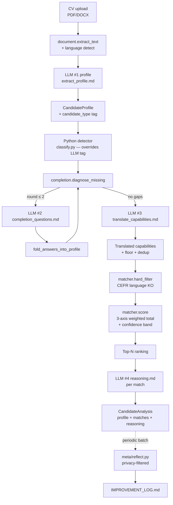

# cv-bau-students

Student / fresh-graduate / career-changer matching pipeline. Extends a
BAU recruiter platform that already handles experienced candidates;
this repo provides the layer that handles CVs without years of work
history — school projects, thesis work, brigády, courses, and prior-
domain achievements get translated into "experienced-equivalent"
capabilities so the matcher can compare them against job ads written
for experienced candidates.

Sister project: [`cv-estimator`](https://github.com/buhlez31/cv-estimator)
(round-1 salary estimator). Shared infrastructure pattern (Pydantic
contract, LLM wrapper, skepticism prompt, Streamlit scaffolding) but
disjoint product scope.

## TL;DR

- **Pipeline.** Document extract → LLM #1 profile extraction → Python
  detector (student / changer / experienced) → iterative completion
  loop (LLM #2, asks for missing data) → LLM #3 capability translator
  (school project / thesis / brigáda → experienced-language capabilities)
  → SQL-backed matcher (skill_fit + bridge_fit + personal_fit) → LLM
  #4 reasoning per top match.
- **Comparability stance.** Never compare years. Compare demonstrated
  skills + bridgeable gaps to next level. Per-domain junior / medior /
  senior checklists encode what's bridgeable in a short course versus
  what can't be shortcut.
- **Data layer.** SQLite from day one via SQLAlchemy — 12 relational
  tables for candidates, taxonomy, level checklists, job ads, matches,
  reasoning cache. CSV files are the human-edited source of truth,
  loaded into the DB on startup. Postgres migration = change one DSN.
- **Cost discipline.** Tables / Python for everything deterministic
  (taxonomy, alias resolution, bridge math, hard filters, detector).
  LLM only for unstructured-text passes (profile extraction, completion
  questions, capability translation, reasoning, meta-reflection).
- **Meta-reflection.** Privacy-filtered LLM pass over batches of runs
  writes pipeline-improvement observations to `IMPROVEMENT_LOG.md`.
  Aggregate-only — no CV text, names, or ad URLs reach the prompt.

## Run (local dev)

```bash
python3.11 -m venv venv
source venv/bin/activate
pip install -r requirements-dev.txt
pip install -e . --no-deps

cp .env.example .env                    # add ANTHROPIC_API_KEY

# Build the SQLite DB and load taxonomy + level checklists
python scripts/load_seeds.py

# Optional: generate synthetic job ads (uses 1 LLM call per ad)
python scripts/generate_synthetic_ads.py --per-cell 1

# Optional: normalise pre-scraped real ads from data/raw_ads/scraped
python scripts/normalise_scraped_ads.py

pytest -q                               # 54 tests, in-memory SQLite, no network

streamlit run src/cv_bau_students/ui/app.py
```

## Pipeline



LLM calls per analysis: 4 fixed (profile + translate + 2 reasoning at
top-5 cap) + up to 2 conditional (completion rounds when sparse). Cost
≈ $0.05 per CV with caching off; reasoning_cache + lru_cache on
translator drop repeat-analysis cost near zero.

## Comparability stance

| Old approach | This pipeline |
|---|---|
| Compare candidate's years of experience to ad's "5+ years required" | **Drop the years axis entirely** — students never have it. |
| Match candidate's listed skills to ad's must-have list | Match **translated capabilities** sourced from thesis, school projects, brigády, internships — each with verbatim evidence quote + confidence + caveat. |
| Surface a single 0-100 score | Surface **3 axes** (skill_fit / bridge_fit / personal_fit) + **confidence band** + **bridge plan**. The recruiter sees actionable gaps, not just a number. |
| Mix students into the same ranked list as experienced candidates | **Two separate ranked lists** side-by-side with independent scales. The recruiter knows to calibrate expectations before reading the score. |

The bridge plan reads from `data/level_checklists.csv` (junior / medior
/ senior skill expectations per domain). For each gap it records
`bridgeable_in_months` or `None` — the latter is the "experience-only,
no shortcut" wall the comparability stance explicitly preserves.

## Architecture: hybrid fork of cv-estimator

Decision rationale (full plan in `~/.claude/plans/`):

| Path | Pros | Cons | Verdict |
|---|---|---|---|
| Build atop cv-estimator | Fastest start | Two products in one repo, schema collisions | Rejected |
| Greenfield | Cleanest separation | Rebuild LLM wrapper + Pydantic discipline + Streamlit scaffold + deploy lessons | Rejected |
| **Hybrid fork** | ~60 % code reuse with clean separation | Initial fork investment | **Chosen** |

What transferred from cv-estimator:
- `llm.py` (Anthropic wrapper, prompt loader, JSON-fence strip,
  lazy import)
- `extractors/document.py` (PDF/DOCX + language detect)
- Pydantic discipline (`models.py` as the single output contract)
- Skepticism prompt patterns (confidence + caveat + sequential ≠
  synthesis + person ≠ role)
- Streamlit scaffolding + Secrets bridge for deploy
- Test pattern (autouse fixture, mock-by-prompt-substring dispatcher)
- Deploy lessons (package-data declaration, `.` in requirements,
  `__init__.py` in subpackage data dirs)

What's new for cv-bau-students:
- 12-table SQLAlchemy schema (vs cv-estimator's pure CSV)
- Student-aware extraction + iterative completion loop
- Capability translator (student artefacts → experienced language)
- 3-axis matcher with bridge plan
- Meta-reflection privacy-filtered logger

## Data layer

SQLite via SQLAlchemy. 12 tables, sketched:

```
candidates              (id, cv_hash, language, type, created_at)
profile_versions        (id, candidate_id, round, profile_json, created_at)
completion_questions    (id, candidate_id, round, field, question, answer)
translated_capabilities (id, candidate_id, skill_canonical, evidence_quote,
                         confidence, caveat, source_type, relevance)
skills                  (id, canonical_name, family)
skill_aliases           (alias, canonical_id)
skill_hierarchy         (parent_id, child_id)
level_checklists        (id, domain, level, skill_id, bridgeable_in_months, notes)
job_ads                 (id, title, employer, location, remote_mode, level,
                         domain, source, raw_text, ad_url, languages_required)
job_ad_skills           (id, ad_id, skill_id, requirement)
matches                 (id, candidate_id, ad_id, skill_fit, bridge_fit,
                         personal_fit, total, confidence_band, bridge_plan_json)
reasoning_cache         (id, candidate_id, ad_id, prompt_hash, rationale)
```

CSV seeds live at `src/cv_bau_students/data/`:
- `taxonomy_seed.csv` — canonical skills + aliases + hierarchy (50+
  rows for the IT / business demo set).
- `level_checklists.csv` — 8 demo domains × {junior, medior, senior}
  × skill, with `bridgeable_in_months` per row.

Production migration to Postgres = change `CV_BAU_STUDENTS_DB_URL`.
SQLAlchemy abstracts the dialect.

## Design choices

| Choice | Rationale |
|---|---|
| SQLite from day one | This product makes hiring decisions. Persistent state + audit log are non-negotiable. CSV-only would simulate this badly. |
| Hybrid fork of cv-estimator | 60 % code reuse, clean separation, fastest path to a working demo. |
| Detector = Python first, LLM tag is advisory | Hard rules > LLM vibes. The LLM tag is recorded but the heuristic wins; disagreement is logged for audit. |
| Iterative completion bounded at 2 rounds | Recruiter / candidate fatigue cap. Open fields stay explicit `None` in the output — surfaced as "missing data" in the UI, never hallucinated. |
| All-LLM translator | Single mechanism for student / changer / experienced. Skepticism + per-source-type confidence calibration in the prompt, not in Python. |
| 3-axis matcher (skill / bridge / personal) | Replaces the years axis the student pipeline can't use. Bridge plan turns the number into an actionable list. |
| Two ranked lists in the recruiter UI | Students-with-potential vs experienced get independent scales. Avoids the "student 65 must be worse than experienced 70" trap. |
| Meta-reflection log is advisory only | The system writes observations; humans iterate the prompts. Auto-applying suggestions would risk runaway prompt drift. |

## Tests

```bash
pytest -q   # 54 tests, no network — LLM calls patched per test
```

## License

MIT — see [LICENSE](LICENSE).
