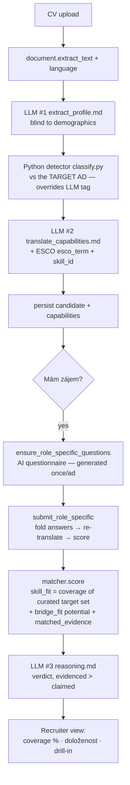

# cv-bau-students

Round-2 AI matching platform for **students / fresh-graduates / career-changers**.
It translates CVs *without* years of work history — school projects, thesis work,
brigády, courses, prior-domain achievements — into "experienced-equivalent"
capabilities, then scores every candidate on **skill coverage of one target job
ad** so a recruiter can compare a student and an experienced hire on the same,
fair axis: skills, not tenure.

Hybrid code-fork of the round-1 [`cv-estimator`](https://github.com/buhlez31/cv-estimator)
(shared infra pattern: Pydantic contract, LLM wrapper, skepticism prompt,
Streamlit scaffolding; disjoint product scope).

## TL;DR

- **Single-target MVP.** One pre-selected job ad ("Datový analytik"). Every
  uploaded CV is matched against *that* ad only; the recruiter curates the
  target skill set and everyone is scored on coverage of it.
- **Score = skill coverage (criterion-referenced).** `skill_fit` = % of the
  recruiter's curated target skill set the candidate evidences; `total ==
  skill_fit`. **`bridge_fit`** is a *separate* "potential / growth" signal
  (how bridgeable the level gaps are), shown beside the headline — never folded
  in. `personal_fit` is retired. Grounded in I/O research: tenure barely
  predicts performance, so we score demonstrated skills, not years.
- **Doloženost (evidence strength).** Each matched skill is tagged by *how* it
  was demonstrated — 🟢 work/internship/cert · 🟡 project/thesis/course · ⚪
  claimed-only — and aggregated into a "doloženost" reliability label. This
  replaces the old LLM self-confidence band.
- **Two-pass candidate journey.** `run_generic_pass` (extract + translate, ~2
  LLM calls) → `express_interest` (AI questionnaire, surfaces hidden skills) →
  `submit_role_specific` (re-translate with answers + 1 reasoning call). The
  recruiter then sees a scored, evidence-tagged list with a per-candidate AI
  verdict.
- **Trust by design.** Skills-only scoring (no demographic features; extraction
  blinds name/gender/age); transparency notices; human-in-the-loop (score is
  decision-support, never auto-reject); audit trail (raw CV + breakdown). See
  [`docs/MODEL_CARD.md`](docs/MODEL_CARD.md) (EU AI Act high-risk + GDPR Art. 22).
- **Data layer.** 18-table SQLAlchemy schema. SQLite for local/dev (restored
  from a bundled, role-scoped `seed.sqlite.gz`); **Postgres/Neon** for a
  persistent deploy (uploaded CVs survive Streamlit Cloud restarts) — change one
  DSN. See [`docs/DEPLOY.md`](docs/DEPLOY.md).

## Run (local dev)

```bash
python3.11 -m venv venv
source venv/bin/activate
pip install -r requirements.txt
pip install -e . --no-deps          # SSL-cert workaround in this env; or a .pth file

cp .env.example .env                # add ANTHROPIC_API_KEY (owner-run; agent key is scrubbed)

# Restore the bundled role-scoped seed (ESCO data-role skills + the demo ad)
python -c "from cv_bau_students.bootstrap import ensure_seeded; ensure_seeded()"

# Seed the demo: prepare the target ad + walk the 6 synthetic CVs (~LLM calls)
python -m scripts.seed_target_demo

pytest -q                           # 192 tests, in-memory SQLite, no network
streamlit run src/cv_bau_students/ui/app.py
```

Two-tab Streamlit: **Kandidát** (upload CV → see the position detail → express
interest → answer 3 role questions) and **Recruiter** (curate target skills →
scored candidate list with coverage % + doloženost + drill-in).

## Pipeline (two-pass)



LLM calls: **upload ≈ 2** (extract + translate); **interest** = questions once
per ad (cached); **submit** ≈ 1 (reason; translate cached). Extended thinking is
on for the two interpretive calls (translate, reason) — toggle with
`CV_BAU_STUDENTS_THINK=0`. `reasoning_cache` + `lru_cache` on the resolvers drop
repeat cost near zero.

## Scoring & comparability

| Old approach | This pipeline |
|---|---|
| Compare years of experience to "5+ years required" | **Drop the years axis** — students don't have it; tenure is a weak performance predictor. |
| Match listed skills to a must-have list | Match **translated capabilities** (thesis / projects / brigády / work) → resolved to **ESCO** skill ids, each with a verbatim evidence quote + source_type. |
| One opaque 0–100 score | **Coverage % of the recruiter-curated target set** (headline) + **bridge_fit** potential (separate) + **doloženost** (evidence strength) + the matched/missing breakdown. |
| Mix students into the experienced ranking | **Separate student / experienced columns** + career-changers — same fair axis, calibrated display. |

The recruiter **skill-picker** curates the role's target skills (suggested from
the ad's ISCO occupation family); saving re-scores all candidates deterministically
(no LLM). `bridge_fit` reads `data/level_checklists.csv` (per-domain junior /
medior / senior expectations); `bridgeable_in_months=None` is the
"experience-only, no shortcut" wall.

**Candidate type** (student / career_changer / experienced) is decided by a
deterministic Python classifier that **overrides** the LLM tag, judged relative
to the target ad: <2y real work / only brigády / studying / fresh grad →
*student* (potential); ≥2y work in a *different* field than the ad →
*career_changer*; ≥2y aligned work → *experienced*.

## Trust & compliance

- **Skills-only.** No demographic features enter the score; the extract +
  translate prompts are instructed to ignore name/gender/age/nationality.
- **Human-in-the-loop.** The recruiter decides; the score is advisory and never
  auto-rejects. Each candidate has a human-readable explanation (verdict +
  matched/missing skills + per-skill evidence + raw CV).
- **Honest framing.** CV skills are labelled self-reported / not verified; the
  questionnaire probes specifics — it never auto-accuses.
- [`docs/MODEL_CARD.md`](docs/MODEL_CARD.md) documents intended use, method,
  data, fairness stance (incl. the calibration impossibility theorem), EU AI Act
  high-risk classification, GDPR Art. 22, and known limits.

## Data layer

18-table SQLAlchemy schema (SQLite local / Postgres prod), incl.: `candidates`,
`profile_versions`, `translated_capabilities` (with `esco_skill_id`),
`candidate_interests`, `matches` (with `skill_fit_detail_json` →
matched/missing + `matched_evidence`), `role_specific_questions` /
`role_specific_answers`, `ad_target_skills` (recruiter-curated target set),
`job_ads` / `job_ad_skills`, and the taxonomy tables `skills`, `skill_aliases`,
`skill_hierarchy`, `skill_industry_map` (occupation→skill), `occupations`,
`level_checklists`.

### Skill taxonomy: ESCO primary + NSP overlay (role-scoped seed)

- **ESCO v1.2.x** (CC BY 4.0) — ~14k skills + aliases + hierarchy + occupation→
  skill map (en+cs), loaded via `scripts/load_esco_csv.py`,
  `load_esco_hierarchy.py`, `load_esco_occupations.py`,
  `load_esco_occupation_labels.py`.
- **Czech NSP / CDK** (CC0) — Czech-native skill-name aliases on the ESCO
  backbone (`scripts/load_nsp.py`), helping Czech CV resolution.

Resolution: deterministic normalize (lowercase + diacritics strip) → alias join
→ rapidfuzz fuzzy fallback; the translator also emits an English `esco_term` for
cross-lingual matching. Both `resolve_skill` (seed namespace) and
`resolve_skill_esco` (ESCO namespace) are memoized.

**Role-scoped seed.** The shipped `seed.sqlite.gz` is *scoped to the data-role
family* (ESCO data analyst + data scientist + data engineer ≈ 100 skills + the
demo ad), built by `scripts/build_scoped_seed.py` → `build_cloud_seed.py`. This
keeps the single-target demo tiny (~2k rows) so cold-start is sub-second instead
of pulling ~200k rows. Rebuild for a different role via `--isco` / occupation
list (see `docs/DEPLOY.md`).

## Deploy (Streamlit Cloud + persistence)

- **Ephemeral SQLite** (default): the bundled scoped seed restores on every cold
  start — fine for a read-only demo, uploads vanish on restart.
- **Postgres / Neon** (persistent): set `CV_BAU_STUDENTS_DB_URL`; pour the demo
  in once with `scripts/migrate_sqlite_to_postgres.py` (re-syncs id sequences;
  `--truncate --confirm-destroy` guards against wiping candidate data). Uploaded
  CVs then survive restarts. Full guide: [`docs/DEPLOY.md`](docs/DEPLOY.md).

Streamlit Secrets:
```toml
ANTHROPIC_API_KEY      = "sk-ant-…"
CV_BAU_STUDENTS_DB_URL = "postgresql://…?sslmode=require"   # optional, for persistence
```

## Design choices

| Choice | Rationale |
|---|---|
| Single target ad | Makes the metric interpretable (coverage of one curated set) and the demo readable. Corpus-wide ranking is above MVP scope. |
| Criterion-referenced skill coverage | Fairer than ranking juniors against peers; I/O literature backs skills over tenure. |
| Doloženost from `source_type` | Reliability = how a skill was demonstrated (work/project vs claimed), not LLM self-confidence. |
| Detector overrides the LLM tag, classified vs the ad | Hard rules > prose; "experienced" requires ≥2y real aligned work. |
| Two-pass journey, deferred reasoning | Fast upload (~2 LLM calls); the costly reasoning fires once, only for the ad the candidate chooses. |
| Postgres-ready, role-scoped seed | Persistence without code change; scoping keeps cold-start fast for the single-target use-case. |

## Tests

```bash
pytest -q   # 192 tests, no network — LLM + HTTP calls patched per test
```

## Data Sources & Attribution

Uses the **ESCO** classification of the European Commission (v1.2.x,
[CC BY 4.0](https://creativecommons.org/licenses/by/4.0/),
<https://esco.ec.europa.eu>) and Czech **NSP/CDK** competency data (CC0,
[data.mpsv.cz](https://data.mpsv.cz)). The bundled `seed.sqlite.gz` is a
role-scoped snapshot of that ingest. Demo CVs are synthetic (Apache-2.0). Full
notices: [NOTICES.md](NOTICES.md).

## License

Code: MIT — see [LICENSE](LICENSE). Bundled data: per-dataset, see [NOTICES.md](NOTICES.md).
