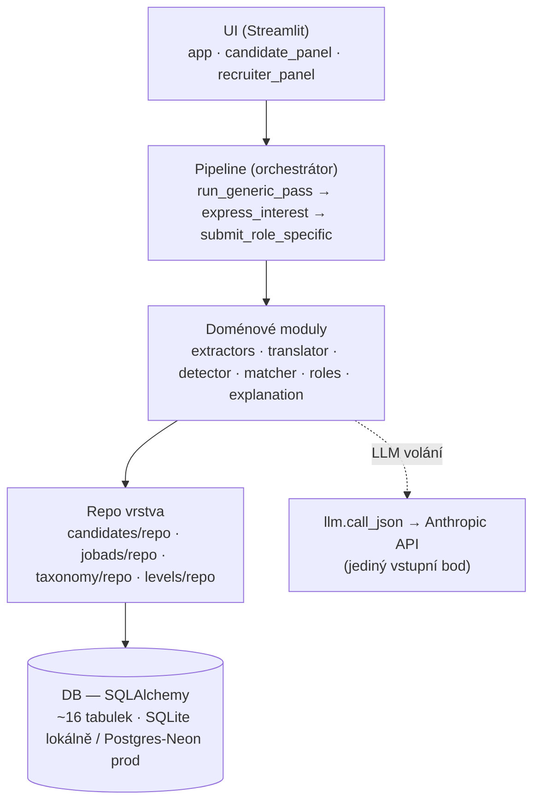
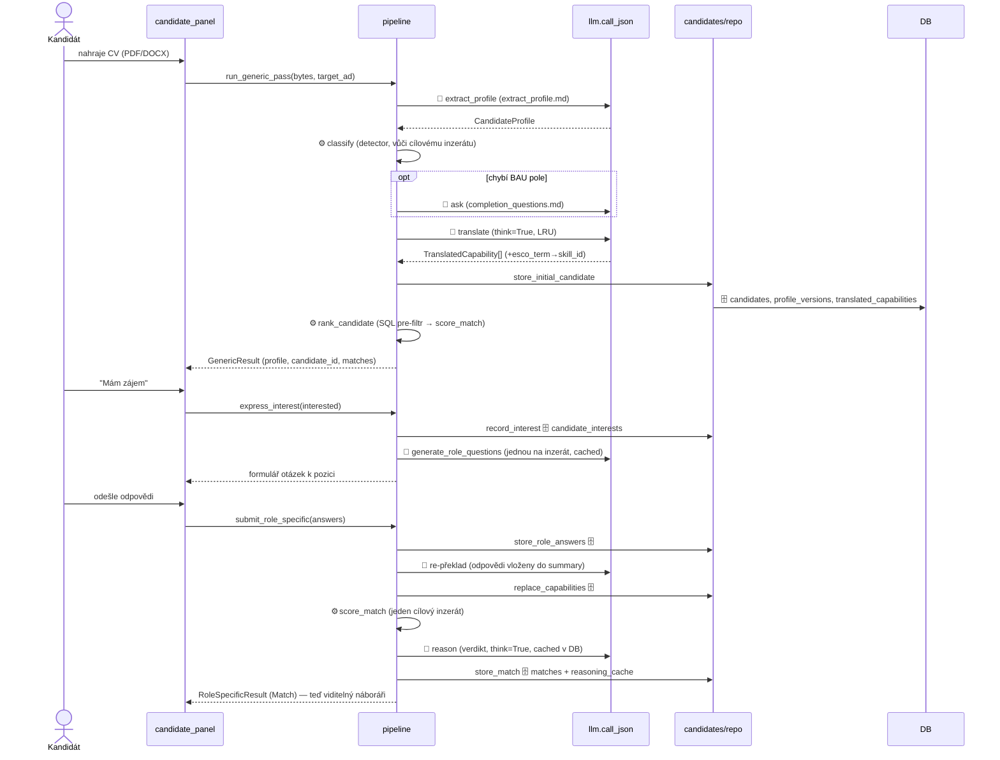
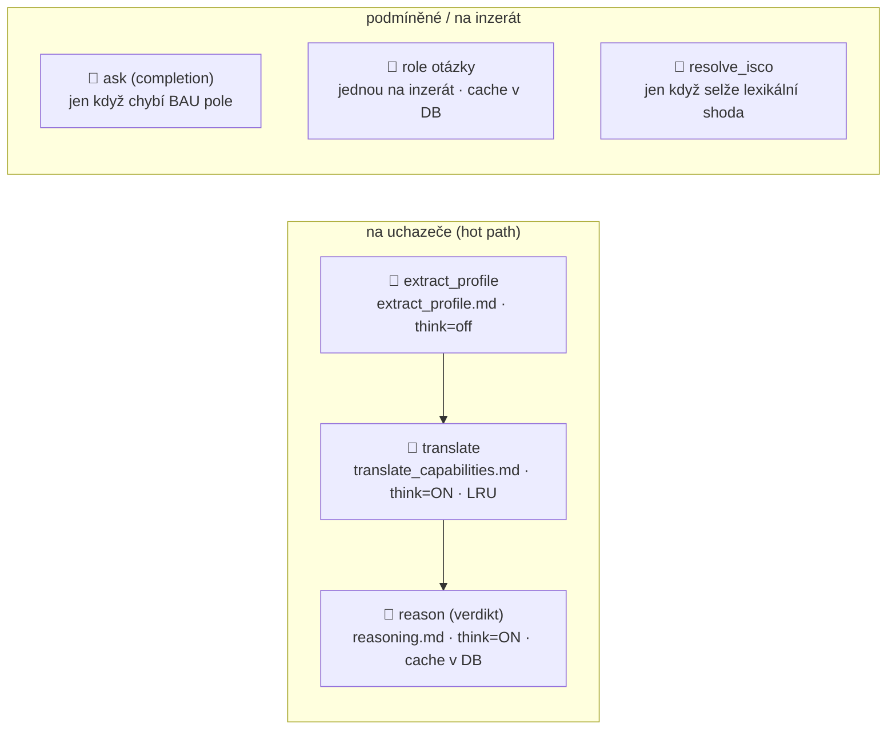
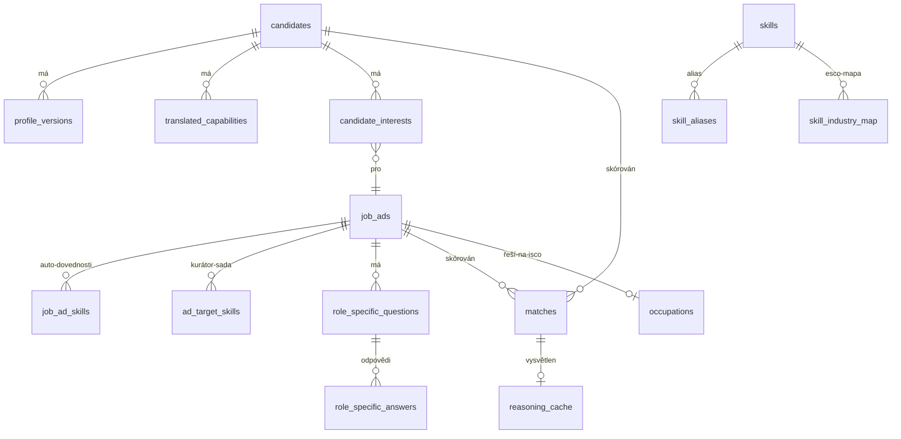

# Architektura — jak cv-bau-students funguje

> Anglická referenční verze: [`ARCHITECTURE.md`](ARCHITECTURE.md).

Studijní průvodce celým systémem: mentální model, čtyři vrstvy, cesta kandidáta,
scoring engine, LLM volání, datový model a designová rozhodnutí za nimi. Kotvy
file:line ukazují na reálný kód, aby tento dokument a zdroj zůstaly v souladu.

> Doprovodné dokumenty: `docs/RISKS.md` (úrovně selhání / answer-key na pohovor),
> `docs/MODEL_CARD.md` (compliance + limity), `docs/research/*` (deep-research
> reporty, které zdůvodňují několik designových voleb).

---

## 0. Mentální model (jedna věta)

**Přelož CV bez pracovní historie na dovednosti → změř, jaké % náborářem
kurátorované cílové sady dovedností kandidát pokrývá → ukaž to transparentně.**

Skóre je **deterministické** (do scoringu nevstupuje žádný LLM); LLM jen
extrahuje, překládá a vysvětluje. Jedna myšlenka, ze které plyne všechno ostatní:
**nahraď „roky praxe" za „% pokrytí dovedností", aby student i senior stáli na
stejné ose.**

---

## 1. Čtyři vrstvy



**Zlaté pravidlo:** pipeline a doménové moduly nikdy nesahají na SQLAlchemy přímo
— všechno jde přes repo vrstvu (Pydantic dovnitř, Pydantic ven). `llm.call_json`
(`llm.py:74`) je jediné dveře k Anthropic API.

---

## 2. Cesta kandidáta (páteř)

Dvouprůchodová cesta v `pipeline.py`. LLM kroky značeny 🧠, čistý Python ⚙️, SQL 🗄️.



Klíčové funkce: `run_generic_pass` (`pipeline.py:151`), `express_interest`
(`pipeline.py:238`), `submit_role_specific` (`pipeline.py:270`),
`ensure_role_specific_questions` (`pipeline.py:224`).

**Reálná LLM hot-path na uchazeče = ~4 volání** (extract, translate, reason,
re-překlad). Role-otázky + ISCO-resolve jsou na *inzerát* (jednou), ne na uchazeče.

---

## 3. Scoring engine — srdce (`matcher/score.py`)

`score_match` (`score.py:39`) → `MatchScore`. Tři osy, ale **jedno headline číslo**:

- **skill_fit (0–100 %)** — headline. `total = skill_fit` (`score.py:69`).
- **bridge_fit** — sekundární „potenciál růstu" (měsíce do vyšší úrovně); zobrazen
  *vedle* headline, nikdy do něj nezapočítán.
- **personal_fit** — vyřazeno (natvrdo `0.0`; pole ve schématu ponecháno).

### Vzorec pokrytí (`_skill_fit:88`)

```
target = kurátorovaná sada (recruiter skill-picker, ESCO ids)   ← priorita 1
       | jinak ad.must_have ∪ nice_to_have (seed ids)            ← fallback
matched  = candidate ∩ target
coverage = 100 * |matched| / |target|
```

**Příklad:** náborář vybere 4 dovednosti, kandidát doloží 2 →
`100 * 2 / 4 = 50 %`. Žádné váhy, žádný LLM. Auditní objekt `SkillFitDetail`
zaznamenává `role_essential_matched`, `role_essential_missing` (zastropeno na
`ROLE_ESSENTIAL_GAP_SAMPLE = 8`) a tier doloženosti u každé dovednosti.

### Proč dva jmenné prostory dovedností

| Namespace | Tabulky | Použití | Proč |
|---|---|---|---|
| **seed** | `skills` (esco_uri NULL), `skill_aliases` | recruiter must/nice | ručně udržované, interpretovatelné, auditovatelné |
| **ESCO** | `skills` (esco_uri set), `skill_industry_map` | kurátorovaná sada + role enrichment | navázané na povolání, porovnatelné napříč senioritou |

Kurátorovaná sada se porovnává v ESCO prostoru; must/nice fallback v seed prostoru.
Resolvery: `resolve_skill` (`taxonomy/repo.py:72`, seed, diacritics fallback) a
`resolve_skill_esco` (`taxonomy/repo.py:184`, ESCO, fuzzy ≥92 + strip kvalifikátorů).

### Síla důkazu („doloženost")

`_evidence_tier_by_id` (`score.py:148`) mapuje `source_type` každé doložené
dovednosti na tier (nejsilnější vyhrává): 🟢 **strong** (internship / open_source /
certification) · 🟡 **medium** (thesis / school_project / course) · ⚪ **weak**
(brigáda / hobby / jen uvedeno). Definováno v `evidence.py`. Nahradilo
sebejistotu LLM jako náborářský signál spolehlivosti (research #5).

### Confidence band

`_confidence_band` (`score.py:218`): `max(5, 30 − 25·avg_confidence)`. Průměr 1.0 →
±5 (úzké); průměr 0.3 → ±26 (široké); žádné capabilities → ±30.

### SQL pre-filtr

`find_candidate_ads` (`jobads/repo.py`) používá `EXISTS` subquery, aby zúžil
sadu inzerátů (např. 5000 → ~50) ještě než běží Python scorer; `rank_candidate`
(`matcher/rank.py:25`) pak skóruje a seřadí top-N. Single-target aplikace skóruje
jeden inzerát přímo a pre-filtr obchází (`pipeline.py` `_score_single_ad`).

---

## 4. LLM volání — mapa



| # | Funkce | Prompt | think | Cache | Kadence |
|---|---|---|---|---|---|
| 1 | `extract_profile` (`extractors/profile.py:20`) | extract_profile.md | ne | — | na uchazeče |
| 2 | `ask` (`completion/ask.py:15`) | completion_questions.md | ne | — | jen když chybí pole |
| 3 | `translate` (`translator/translate.py`) | translate_capabilities.md | **ano** | LRU | na uchazeče |
| 4 | `reason` (`explanation/reason.py:29`) | reasoning.md | **ano** | DB `reasoning_cache` | na uchazeče |
| 5 | `generate_role_questions` (`roles/generate.py:19`) | role_specific_questions.md | ne | DB, jednou/inzerát | na inzerát |
| 6 | `_llm_pick` (`roles/isco_resolver.py`) | resolve_isco.md | ne | — | na inzerát, jen při lexikálním minutí |

`think=True` zapne rozpočtovaný extended-thinking průchod (`config.LLM_THINK_BUDGET`
= 4000 uvnitř `LLM_THINK_MAX_TOKENS` = 8000) jen na dvou interpretačních voláních.

**Pozoruhodné propojení SQL→LLM:** ISCO resolver se dotáže tabulky `occupations`,
z řádků postaví shortlist menu a vloží ho jako `options` do promptu `resolve_isco`
— SQL-odvozená data jdou přímo do LLM promptu.

---

## 5. Datový model (~16 tabulek, seskupeno)



- **Kandidát:** `candidates` (cv_hash dedup) → `profile_versions` (round 0,1+) →
  `translated_capabilities` (skill_canonical + esco_term + esco_skill_id) +
  `completion_questions`
- **Taxonomie:** `skills` (esco_uri NULL = seed, jinak ESCO) · `skill_aliases` ·
  `skill_hierarchy`
- **Occupation map:** `skill_industry_map` (ISCO→ESCO skill, essential/optional) ·
  `occupations` (labely řídící resolver)
- **Inzerát:** `job_ads` (+ isco_code / isco_method) · `job_ad_skills` (auto
  must/nice) · `ad_target_skills` (recruiter kurátorované core/optional)
- **Úrovně:** `level_checklists` (rubrika bridge-planu)
- **Match:** `matches` (skill_fit, total, confidence_band, skill_fit_detail_json,
  + recruiter_override/override_note/decision_at) · `reasoning_cache`
- **Otázky k pozici:** `role_specific_questions` (na inzerát) · `role_specific_answers`
  (na kandidáta) · `candidate_interests`

Schéma žije v `db_models.py`; repo překládá ORM řádky ↔ Pydantic (`models.py`).

---

## 6. Náborářská strana + trik s přepočtem

- `get_candidates_for_ad` (`candidates/repo.py:377`) — join Candidate × Match ×
  Interest, filtrováno na `interested` + má-Match, řazeno dle `total`; odvozuje
  `doloznost` z `skill_fit_detail.matched_evidence`.
- `get_candidate_detail` (`candidates/repo.py:443`) — plný drill-in (profil,
  capabilities, otázky k pozici, match, raw text CV).
- **`rescore_ad`** (`candidates/repo.py:344`) — když náborář edituje cílové
  dovednosti, Match každého kandidáta se přepočítá přes `score_match`
  (**deterministicky, bez LLM, okamžitě**). To je *proč* musí scorer zůstat
  bez LLM: editace porovnávací osy přeřadí všechny zdarma.

Kandidátská strana **skrývá číselné skóre** a ukazuje dopředu hledící doporučení
(„co doložit"); náborářská strana ukazuje plný rozpad + raw CV + audit.

---

## 7. Studený start / seed (`bootstrap.ensure_seeded`)

Na prázdné DB `_restore_from_seed_snapshot` rozbalí `seed.sqlite.gz` (~2 s; plné
ESCO + 6 demo kandidátů + cílový inzerát ApexFinance). `init_db` vytvoří tabulky a
`db._migrate_columns` **auto-ALTERuje chybějící nullable sloupce** na SQLite +
Postgresu — proto nové nullable sloupce (např. Match override pole) nepotřebují
ruční migraci. `prewarm_llm` spouští démon-vlákno, které brzy importuje Anthropic
SDK, takže první analýza přeskočí ~60s cold import. `_overlay_job_ads` je no-op,
jakmile je `job_ads` naplněné (aby restore znovu nenahrál 481 scrapnutých inzerátů,
které single-target demo nikdy nezobrazí).

---

## 8. Designová rozhodnutí (ty „aha")

1. **Deterministické skórování** → přepočet zdarma + auditovatelné + bez LLM-biasu ve skóre.
2. **Kurátorovaná cílová sada jako denominátor** (ne celá ~600-skillová ESCO
   essential sada, která by srazila každé skóre k 0) → osu porovnání definuje náborář.
3. **Síla důkazu místo sebejistoty LLM** → odolné vůči gamingu (research #5).
4. **Dva namespaces** → interpretovatelnost (seed) a porovnatelnost napříč
   senioritou (ESCO) zároveň.
5. **Verzování profilu + re-překlad** → odpovědi z dotazníku tečou do skóre.
6. **Single-target MVP** → jeden inzerát, recruiter-kurátorovaný, hloubka před šířkou.
7. **Extrakce slepá k demografii + lidský přepis + bias-audit disclosure** →
   postoj k EU AI Act high-risk / GDPR čl. 22 (viz `docs/MODEL_CARD.md`).

---

## 9. Doporučené pořadí čtení

1. `models.py` (Pydantic kontrakt) → `db_models.py` (jak se ukládá)
2. `pipeline.py` (páteř, čti shora) → `matcher/score.py` (srdce)
3. `candidates/repo.py` (read/write cesty) → `ui/candidate_panel.py` +
   `ui/recruiter_panel.py`
4. `prompts/*.md` (co která LLM volání žádají) → `taxonomy/repo.py` (resolution)
5. `docs/RISKS.md` + `docs/MODEL_CARD.md` (answer-key + compliance story)

---

*Kotvy odpovídají `main` v době psaní; pokud se číslo řádku posune, grepni název
funkce — struktura je stabilní.*
