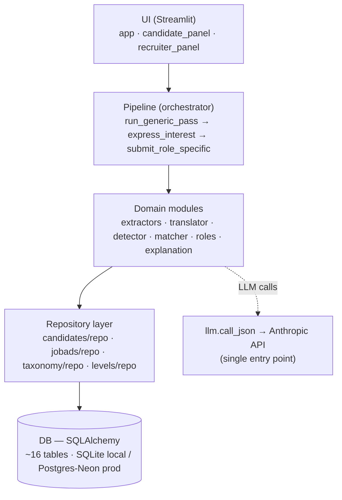
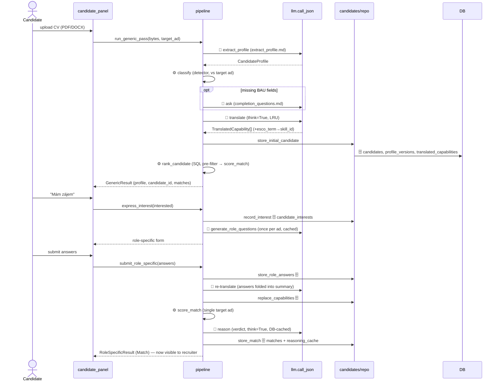
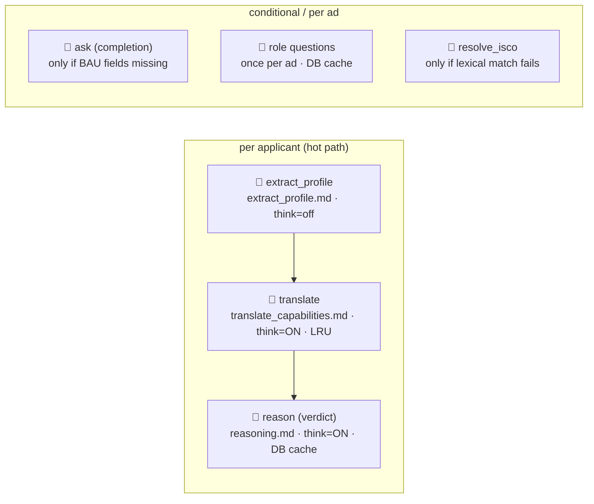
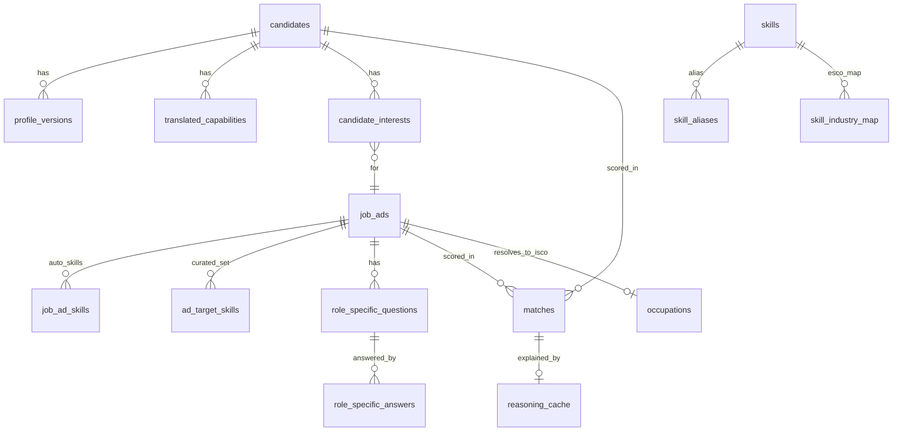

# Architecture — how cv-bau-students works

> Česká verze: [`ARCHITECTURE.cs.md`](ARCHITECTURE.cs.md).

A study guide to the whole system: the mental model, the four layers, the
candidate journey, the scoring engine, the LLM calls, the data model, and the
design decisions behind them. File:line anchors point at the real code so this
doc and the source stay honest together.

> Companion docs: `docs/RISKS.md` (failure tiers / interview answer-key),
> `docs/MODEL_CARD.md` (compliance + limits), `docs/research/*` (deep-research
> reports that justify several design choices).

---

## 0. Mental model (one sentence)

**Translate a CV with no work history into skills → measure what % of the
recruiter-curated target skill set the candidate covers → show it transparently.**

The score is **deterministic** (no LLM in the scoring path); the LLM only
extracts, translates, and explains. The one idea everything else follows from:
**replace "years of experience" with "% skill coverage" so a student and a senior
sit on the same axis.**

---

## 1. The four layers



**Golden rule:** the pipeline and domain modules never touch SQLAlchemy directly
— everything goes through the repo layer (Pydantic in, Pydantic out).
`llm.call_json` (`llm.py:74`) is the single door to the Anthropic API.

---

## 2. The candidate journey (the spine)

Two-pass journey in `pipeline.py`. LLM steps marked 🧠, pure-Python ⚙️, SQL 🗄️.



Key functions: `run_generic_pass` (`pipeline.py:151`), `express_interest`
(`pipeline.py:238`), `submit_role_specific` (`pipeline.py:270`),
`ensure_role_specific_questions` (`pipeline.py:224`).

**Real per-applicant LLM hot path = ~4 calls** (extract, translate, reason,
re-translate). Role-question + ISCO-resolve are per-*ad* (once), not per applicant.

---

## 3. The scoring engine — the heart (`matcher/score.py`)

`score_match` (`score.py:39`) → `MatchScore`. Three axes, but **one headline**:

- **skill_fit (0–100 %)** — the headline. `total = skill_fit` (`score.py:69`).
- **bridge_fit** — secondary "growth potential" (months to level up); shown
  *beside* the headline, never folded in.
- **personal_fit** — retired (hard-coded `0.0`; schema field kept).

### The coverage formula (`_skill_fit:88`)

```
target = curated set (recruiter skill-picker, ESCO ids)   ← priority 1
       | else ad.must_have ∪ nice_to_have (seed ids)      ← fallback
matched  = candidate ∩ target
coverage = 100 * |matched| / |target|
```

**Worked example:** recruiter curates 4 skills, candidate evidences 2 →
`100 * 2 / 4 = 50 %`. No weights, no LLM. The `SkillFitDetail` audit object
records `role_essential_matched`, `role_essential_missing` (capped at
`ROLE_ESSENTIAL_GAP_SAMPLE = 8`), and per-skill evidence tiers.

### Why two skill namespaces

| Namespace | Tables | Used for | Why |
|---|---|---|---|
| **seed** | `skills` (esco_uri NULL), `skill_aliases` | recruiter must/nice | human-maintained, interpretable, auditable |
| **ESCO** | `skills` (esco_uri set), `skill_industry_map` | curated set + role enrichment | occupation-aligned, comparable across seniority |

The curated set is compared in ESCO space; the must/nice fallback in seed space.
Resolvers: `resolve_skill` (`taxonomy/repo.py:72`, seed, diacritics fallback) and
`resolve_skill_esco` (`taxonomy/repo.py:184`, ESCO, fuzzy ≥92 + qualifier strip).

### Evidence strength ("doloženost")

`_evidence_tier_by_id` (`score.py:148`) maps each matched skill's `source_type`
to a tier (strongest wins): 🟢 **strong** (internship / open_source /
certification) · 🟡 **medium** (thesis / school_project / course) · ⚪ **weak**
(brigáda / hobby / explicit-only). Defined in `evidence.py`. This replaced
LLM self-confidence as the recruiter-facing reliability signal (research #5).

### Confidence band

`_confidence_band` (`score.py:218`): `max(5, 30 − 25·avg_confidence)`. Avg 1.0 →
±5 (tight); avg 0.3 → ±26 (wide); no capabilities → ±30.

### SQL pre-filter

`find_candidate_ads` (`jobads/repo.py`) uses an `EXISTS` subquery to narrow the
ad set (e.g. 5000 → ~50) before the Python scorer runs; `rank_candidate`
(`matcher/rank.py:25`) then scores + sorts top-N. The single-target app scores
one ad directly and bypasses the pre-filter (`pipeline.py` `_score_single_ad`).

---

## 4. LLM calls — the map



| # | Function | Prompt | think | Cache | Cadence |
|---|---|---|---|---|---|
| 1 | `extract_profile` (`extractors/profile.py:20`) | extract_profile.md | no | — | per applicant |
| 2 | `ask` (`completion/ask.py:15`) | completion_questions.md | no | — | only if fields missing |
| 3 | `translate` (`translator/translate.py`) | translate_capabilities.md | **yes** | LRU | per applicant |
| 4 | `reason` (`explanation/reason.py:29`) | reasoning.md | **yes** | DB `reasoning_cache` | per applicant |
| 5 | `generate_role_questions` (`roles/generate.py:19`) | role_specific_questions.md | no | DB, once/ad | per ad |
| 6 | `_llm_pick` (`roles/isco_resolver.py`) | resolve_isco.md | no | — | per ad, only on lexical miss |

`think=True` enables a budgeted extended-thinking pass (`config.LLM_THINK_BUDGET`
= 4000 inside `LLM_THINK_MAX_TOKENS` = 8000) on the two interpretive calls only.

**Notable SQL→LLM coupling:** the ISCO resolver queries the `occupations` table,
builds a shortlist menu from the rows, and injects it as `options` into the
`resolve_isco` prompt — SQL-derived data going directly into an LLM prompt.

---

## 5. The data model (~16 tables, grouped)



- **Candidate:** `candidates` (cv_hash dedup) → `profile_versions` (round 0,1+) →
  `translated_capabilities` (skill_canonical + esco_term + esco_skill_id) +
  `completion_questions`
- **Taxonomy:** `skills` (esco_uri NULL = seed, else ESCO) · `skill_aliases` ·
  `skill_hierarchy`
- **Occupation map:** `skill_industry_map` (ISCO→ESCO skill, essential/optional) ·
  `occupations` (labels driving the resolver)
- **Job ad:** `job_ads` (+ isco_code / isco_method) · `job_ad_skills` (auto
  must/nice) · `ad_target_skills` (recruiter curated core/optional)
- **Levels:** `level_checklists` (bridge-plan rubric)
- **Match:** `matches` (skill_fit, total, confidence_band, skill_fit_detail_json,
  + recruiter_override/override_note/decision_at) · `reasoning_cache`
- **Role Q&A:** `role_specific_questions` (per ad) · `role_specific_answers`
  (per candidate) · `candidate_interests`

Schema lives in `db_models.py`; repos translate ORM rows ↔ Pydantic
(`models.py`).

---

## 6. The recruiter side + the rescore trick

- `get_candidates_for_ad` (`candidates/repo.py:377`) — joins Candidate × Match ×
  Interest, filtered to `interested` + has-Match, ordered by `total`; derives
  `doloznost` from `skill_fit_detail.matched_evidence`.
- `get_candidate_detail` (`candidates/repo.py:443`) — full drill-in (profile,
  capabilities, role Q&A, match, raw CV text).
- **`rescore_ad`** (`candidates/repo.py:344`) — when the recruiter edits the
  target skills, every candidate's Match is recomputed via `score_match`
  (**deterministic, no LLM, instant**). This is *why* the scorer must stay
  LLM-free: editing the comparison axis re-ranks everyone for free.

The candidate side **hides the numeric score** and shows forward-looking recourse
("co doložit"); the recruiter side shows the full breakdown + raw CV + audit.

---

## 7. Cold-start / seed (`bootstrap.ensure_seeded`)

On an empty DB, `_restore_from_seed_snapshot` gunzips `seed.sqlite.gz` (~2s; full
ESCO + the 6 demo candidates + the ApexFinance target ad). `init_db` creates
tables and `db._migrate_columns` **auto-ALTERs missing nullable columns** on
SQLite + Postgres — which is why new nullable columns (e.g. the Match override
fields) need no hand-written migration. `prewarm_llm` runs a daemon thread that
imports the Anthropic SDK early so the first analysis skips the ~60s cold import.
`_overlay_job_ads` is a no-op once `job_ads` is populated (so a restore doesn't
re-ingest the 481 scraped ads the single-target demo never shows).

---

## 8. Design decisions (the "aha"s)

1. **Deterministic scoring** → free rescore + auditable + no LLM bias in the score.
2. **Curated target set as the denominator** (not the full ~600-skill ESCO
   essential set, which would crush every score toward 0) → the recruiter defines
   the comparison axis.
3. **Evidence strength over LLM self-confidence** → gaming-resistant (research #5).
4. **Two namespaces** → interpretability (seed) and cross-seniority comparability
   (ESCO) at once.
5. **Profile versioning + re-translate** → questionnaire answers flow into the score.
6. **Single-target MVP** → one ad, recruiter-curated, depth over breadth.
7. **Demographic-blind extraction + human override + bias-audit disclosure** →
   EU AI Act high-risk / GDPR Art. 22 posture (see `docs/MODEL_CARD.md`).

---

## 9. Suggested reading path

1. `models.py` (the Pydantic contract) → `db_models.py` (how it persists)
2. `pipeline.py` (the spine, read top-down) → `matcher/score.py` (the heart)
3. `candidates/repo.py` (read/write paths) → `ui/candidate_panel.py` +
   `ui/recruiter_panel.py`
4. `prompts/*.md` (what each LLM call asks) → `taxonomy/repo.py` (resolution)
5. `docs/RISKS.md` + `docs/MODEL_CARD.md` (the answer-key + compliance story)

---

*Anchors reflect `main` at the time of writing; if a line number drifts, grep the
function name — the structure is stable.*
